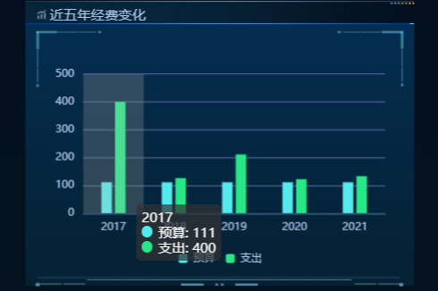

# echarts-extend





echarts 的扩展。

```js
`.
|-- README.md
|-- demo
|   |-- index.html
|   `-- static
|       |-- echarts.min.5.1.0.js
|       `-- index.js
|-- src
|   `-- index.js
`-- static
    `-- readme-img
        `-- demo1.gif
`