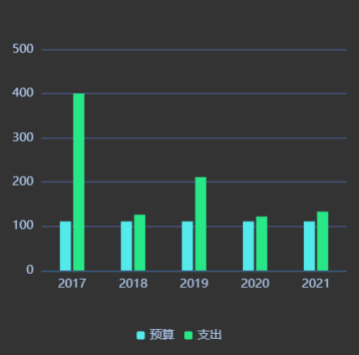

# Echarts-Extend

> echarts在构建大屏的时候经常会需要一些，数据预览动画、活泼页面的间次动画<br>
而echarts并没有封装相关方法

<br>

#### Demo1


因而做了一些 echarts 的扩展。<br>
像刚才的gif里的动画，在引入此插件之后只需将数据长度和动画名传入就好。

```js
    var myEchartObj = echarts.init(document.getElementById('myEchartNode'));
    var option = {
        ...你的echarts配置
    }
    option.nzAnimation = {
        // 动画名称
        mationName:'setinterval01',
        // 数据长度
        dataLength: data.length,
    };
    // 声明 用echarts实例 根据 option 构建
    myEchartObj.setOption(option);
```

<br>

#### Demo2
再举个栗子




```js
    var myEchartObj = echarts.init(document.getElementById('myEchartNode'));
    var option = {
        ...你的echarts配置
    }
    option.nzAnimation = {
        // 动画名称
        mationName:'setinterval02',
        // 数据长度
        dataLength: data2.length,
        // 播放前等待时长  默认0
        await: 2,
    };
    // 声明 用echarts实例 根据 option 构建
    myEchartObj.setOption(option);
```

#### 目录如下:
~~~
|-- README.md     
|-- demo1
|   |-- index.html
|   `-- static    
|       |-- echarts.min.5.1.0.js
|       `-- index.js
|-- demo2
|   |-- index.html
|   `-- static
|       |-- echarts.min.5.1.0.js
|       `-- index.js
|-- src
|   `-- index.js
`-- static
    `-- readme-img
        |-- demo1.gif
        `-- demo2.gif
